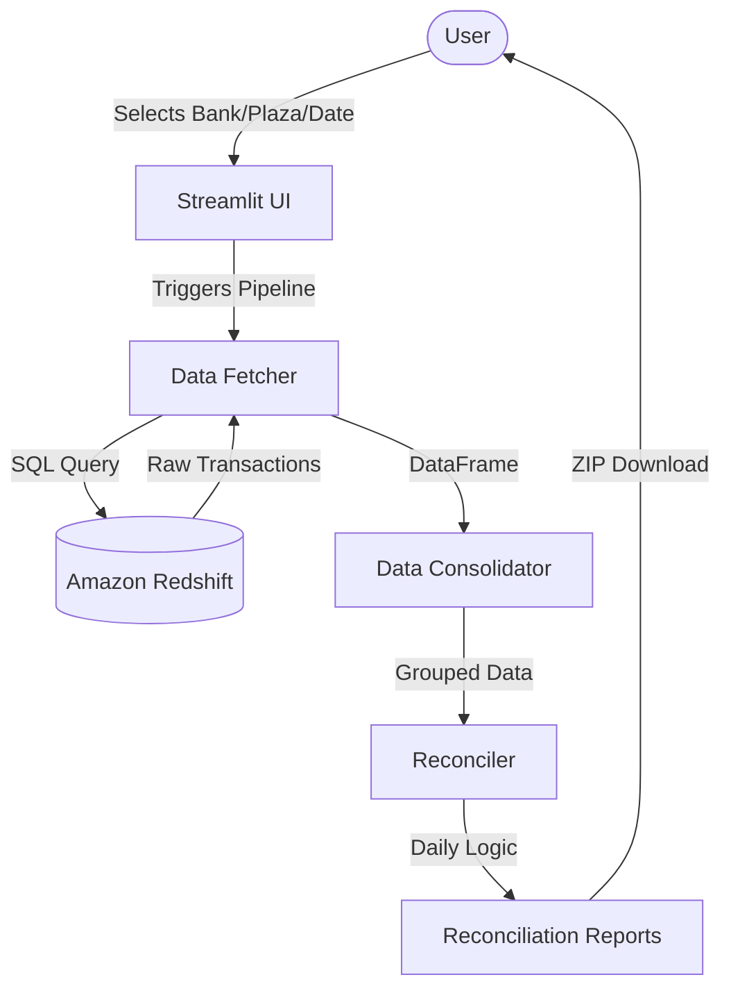

# Annual Pass Reconciler - Technical Documentation

## Overview
The **Annual Pass Reconciler** (`annual_pass_reconciler.py`) is a production-ready Streamlit application that automates the reconciliation of toll plaza "ANNUALPASS" transactions. It connects directly to an Amazon Redshift database to fetch, process, and reconcile transaction data for IDFC and ICICI banks.

## System Architecture



## Core Components

### 1. Database Connectivity ([db_config.py](file:///home/muditubuntu/Desktop/SunArc/Streamlit/AnnualPassReconcile/db_config.py))
Handles all database interactions using `redshift-connector` or `psycopg2`.
- **Connection**: Managed via environment variables (`REDSHIFT_HOST`, `REDSHIFT_USER`, etc.) defined in `.env`.
- **Query Building**: Dynamically constructs SQL queries based on bank type, selected plazas, and date range.
- **Deduplication Strategy**: Uses `ROW_NUMBER() OVER (PARTITION BY unique_id ORDER BY batch DESC)` to eliminate duplicate records caused by multiple batch loads.

### 2. Main Application (`annual_pass_reconciler.py`)
The central orchestration layer built with Streamlit.
- **UI Layer**: Provides bank selection, project filtering, and date picking.
- **Pipeline Execution**:
  1.  **Fetch**: Retries transaction data filtered by `ANNUALPASS`.
  2.  **Consolidate**: Normalizes data from different banks (IDFC/ICICI) into a standard schema.
  3.  **Reconcile**: Applies business logic to determine ATP (Annual Pass) vs NAP (Non-Annual Pass) eligibility.

### 3. Business Logic (Reconciler)
- **Trip Count**: Group transactions by vehicle (VRN) and calculate trips within a 24-hour cycle.
- **Report Date Rule**: Transactions occurring before 08:00 AM are attributed to the previous calendar day.
- **Qualifying Logic**: A vehicle is a "Qualified NAP" if `TripCount <= 2`.

## Database Schema Mapping

| Field | IDFC Column (`ods_fastag.idfc_transaction_api`) | ICICI Column (`ods_fastag.acquirer_transaction_information`) | Internal App Name |
|-------|-------------------------------------------------|--------------------------------------------------------------|-------------------|
| Plaza ID | `conc_plaza_id` | `ihmclplazacode` | `PlazaID` |
| Vehicle Reg | `conc_vrn_no` | `vrn` | `Vehicle Reg. No.` |
| Tag ID | `conc_tag_id` | `tagid` | `Tag ID` |
| Timestamp | `conc_txn_dt_processed` | `acqtxndateprocessed` | `Reader Read Time` |
| Reason Code | `acq_txn_reason` | `acqtxnreason` | `ReasonCode` |
| Unique ID | `conc_txn_id` | `conctxnid` | *(Used for deduplication)* |

## Installation & Setup

### Prerequisites
- Python 3.8+
- Amazon Redshift credentials

### Setup Steps
1.  **Install Dependencies**:
    ```bash
    pip install -r requirements.txt
    ```
2.  **Configure Environment**:
    Create `.env` file with your credentials:
    ```ini
    REDSHIFT_HOST=...
    REDSHIFT_DB=...
    ...
    ```
3.  **Run Application**:
    ```bash
    streamlit run annual_pass_reconciler.py
    ```

## Maintenance & Troubleshooting
- **Missing Data**: Verify the date range and checking if data has been loaded into Redshift for those dates.
- **Connection Errors**: Check `.env` credentials and VPN/Network connectivity to AWS.
- **Duplicate Data**: The application automatically handles duplicates. If counts mismatch, verify the `batch` column logic in [db_config.py](file:///home/muditubuntu/Desktop/SunArc/Streamlit/AnnualPassReconcile/db_config.py).
